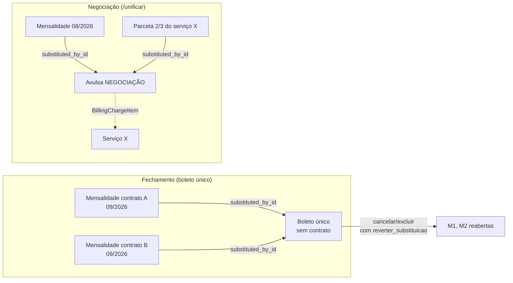

# Invariantes financeiras — obrigação, competência e substituição

Estado a partir da Fase 02 (migration `e5c2a9d71f04`). Cada invariante diz
quem a garante: a aplicação, o banco, ou os dois. Onde é só a aplicação, está
dito.

## Vocabulário

| Termo | O que é no sistema |
|---|---|
| **Cobrança** | Uma linha de `billings`. Pode ou não ter boleto (Ailos/CNAB) e NFS-e. |
| **Obrigação mensal** | A mensalidade de um contrato numa competência. Pode estar em qualquer um dos tipos `recorrente`, `prorata`, `primeira_mensalidade` ou `carne` (`RECURRING_BILLING_TYPES`). |
| **Competência** | `billings.competencia`: 1º dia do mês em que o período começa. Calculada do `period_label` por uma regra única (`app/services/competencia.py` e função SQL `mastersat_competencia`). O rótulo é apresentação. |
| **Cliente atendido × pagador** | `client_id` é o dono do contrato; `payer_client_id` é quem paga (interveniente), congelado na emissão. Nada nesta fase muda essa separação. |
| **Substituição** | Um título assume a dívida de outros (boleto único do fechamento, negociação). As originais ficam canceladas com `substituted_by_id`. |
| **Competência liberada** | Mensalidade cancelada cujo mês o financeiro devolveu para nova cobrança (`competencia_liberada = true`). |

## Invariantes

### I1 — Uma obrigação mensal por contrato e competência

Não pode existir mais de uma cobrança não removida, de tipo mensal, com
competência não liberada, para o mesmo `(contract_id, competencia)`.

- **Banco:** índice único parcial `uq_billings_contract_competencia_recorrente`
  (`is_deleted = false AND competencia_liberada = false AND billing_type IN (…)`).
  A competência é preenchida pelo trigger `trg_billings_competencia` em todo
  INSERT/UPDATE do rótulo, inclusive por quem não conhece a coluna.
- **Aplicação:** `existing_recurring_periods()` (fechamento, carnê, POST
  `/billings`, importador SGR) compara competência; quem cria mensalidade trava
  o contrato antes (`FOR UPDATE`).
- `09/2026`, `9/2026`, `9-2026`, `2026-09` são o mesmo mês. Trimestre, semestre
  e ano ocupam o **primeiro** mês do período (`2026 • T3` → 2026-07-01).
- **Cancelada continua ocupando.** É isso que impede o fechamento de recobrar um
  mês dispensado, negociado ou consolidado. Sair da ocupação exige remover a
  cobrança (soft delete, bloqueado para paga) ou liberar a competência.

Não cobre (limite conhecido): rótulo fora de formato fica sem competência e só
colide com o mesmo texto; contrato de plano trimestral que vira mensal colide
apenas no primeiro mês do trimestre (ver [Decisões pendentes](#decisões-pendentes)).

### I2 — Uma parcela efetiva por serviço avulso

Para cada `(item_id, installment_number)` existe no máximo uma cobrança não
removida que seja **não cancelada, ou cancelada por substituição**.

- **Banco:** `uq_billings_item_parcela_efetiva`.
- **Aplicação:** `generate_item_billings()` trava o `ClientChargeItem` e relê
  antes de gerar; item já faturado por outra operação não gera nada
  (`services_already_billed` no resultado do fechamento).
- Parcela **cancelada sem substituto** sai do índice: é o cancelamento que
  devolve o serviço à fila (regra que já existia).

### I3 — Substituição é explícita e reversível

- Consolidação (boleto único) e negociação (`/billings/unificar`) gravam
  `substituted_by_id` nas originais e continuam escrevendo o marcador nas notas.
- **Banco:** `ck_billings_substituida_cancelada` — só cancelada pode ter
  substituto, e nunca a si mesma. FK `fk_billings_substituted_by_id`.
- Cancelar ou excluir um substituto exige `reverter_substituicao`. A reversão
  reabre as originais (pendente/vencida pelo vencimento), limpa o vínculo e
  registra em `billing_change_logs`. Original com boleto Ailos registrado não é
  reaberta automaticamente (409 `original_com_boleto_registrado`).
- Excluir uma original cujo substituto vale → 409 `titulo_substituido`.
- Cancelar substituto em lote → 409 `titulo_substituto` (tem de ser um a um).

### I4 — Liberar competência é ato explícito e auditado

- `POST /billings/{id}/cancel` com `liberar_competencia: true`, ou
  `POST /billings/{id}/liberar-competencia` para cobrança já cancelada.
- Só mensalidade (`RECURRING_BILLING_TYPES`) e só cancelada
  (**banco:** `ck_billings_liberada_so_cancelada`).
- Original com substituto válido não é liberada (reverter o substituto).
  Original cujo substituto foi removido/cancelado (legado) pode ser liberada.
- Grava `BillingChangeLog(field_name='competencia_liberada')` e nota.

### I5 — Parcelas somam exatamente o total e nenhuma é ≤ 0

- `split_amount_in_installments()` é a única divisão (geração e prévia do
  fechamento). Regra histórica preservada onde era válida: base arredondada e
  diferença na última (100/3 → 33,33 + 33,33 + 33,34; 100/6 → 16,67 × 5 +
  16,65). Onde ela dava última parcela ≤ 0, a base é truncada. Se não cabe 1
  centavo por parcela, recusa.
- Lançamento avulso: total em `Decimal`, preço com no máximo 2 casas, e o par
  total/parcelas validado na criação e na edição (422).
- **Banco:** `ck_billings_amount_positivo`, `ck_billings_paid_amount_positivo`,
  `ck_billings_parcela_no_intervalo`, `ck_client_charge_items_*`,
  `ck_billing_charge_items_amount_positivo`.

### I6 — Referências coerentes na criação manual

POST `/billings` confere contrato, item, veículo e rastreador contra o cliente
atendido. **Só aplicação** — não há FK composta (decisão consciente: dados
históricos podem apontar para cadastros removidos ou transferidos).

### I7 — Nenhum título ativo no banco perde a obrigação local (Fase 03)

- Toda escrita que muda valor, vencimento, situação ou existência de uma
  cobrança passa por `titulo_bancario.exigir()` — tabela única por operação
  e estado do título (sem título, em registro, desfecho desconhecido,
  registrado, baixado, remessa CNAB).
- Cobrança com histórico bancário não é removida; cancelada/recebida por fora
  com título ativo fica com **baixa pendente** (coluna, não nota) e continua
  na conciliação; liberar a competência exige baixa confirmada.
- Detalhes e códigos 409: [runbook-desfecho-desconhecido.md](runbook-desfecho-desconhecido.md).

### I8 — Resultado bancário incerto não libera a cobrança (Fase 03)

- Timeout depois do envio, 5xx, "já cadastrado" sem dados, falha local depois
  do aceite e reserva sem resposta há 30 min → `DESFECHO_DESCONHECIDO`: nada
  muda nem é emitido de novo até a consulta pelo número do documento resolver.
- `ERRO_REGISTRO` (libera) só para rejeição definitiva ou pedido que não saiu.

### I9 — Dinheiro conserva valor (Fase 03)

- Cobrança paga: `paid_amount = amount − desconto − saldo_transferido +
  encargos + credito` (ajustes ativos em `billing_adjustments`).
- Diferença sem classificação é recusada; estorno não apaga o pagamento
  desfeito. Política completa: [politica-pagamento-estorno-conciliacao.md](politica-pagamento-estorno-conciliacao.md).

### I10 — A carteira inteira é conciliada dentro da janela (Fase 03)

- Fila por `ultima_consulta_em`, checkpoint gravado também em erro, orçamento
  por rodada; janela ≈ carteira ÷ orçamento horas, com métrica e alerta.

## Mapa de substituições

| Origem | Originais ficam | Ocupam o mês? | Ocupam a parcela? | Substituto | Reverter |
|---|---|---|---|---|---|
| Boleto único (fechamento) | canceladas, `substituted_by_id` | sim | — | `recorrente`, sem contrato, pagador = interveniente | cancelar/excluir o boleto único com `reverter_substituicao` |
| Negociação (`/unificar`) | canceladas, `substituted_by_id` | sim (se mensalidade) | sim (se parcela de serviço) | `avulsa`, sem contrato; serviços via `billing_charge_items` | idem, na negociação |
| Cancelamento simples | cancelada, sem vínculo | **sim** | não (serviço volta à fila) | — | não há; para recobrar o mês, liberar a competência |
| Cancelamento + liberação | cancelada, `competencia_liberada` | não | não | — | — |
| Exclusão (soft delete) | `is_deleted` | não | não | — | — |

Cadeias funcionam: uma negociação pode unificar um boleto único; reverter a
negociação reabre o boleto único, cujas originais continuam substituídas por
ele.

## Decisões pendentes

Critérios que dependem da empresa. Cada um tem proposta e efeito demonstrável;
o comportamento atual está indicado.

1. **Cancelamento ocupa o mês por padrão.** *Atual (mantido):* sim. *Proposta:*
   manter — liberar é explícito. *Efeito:* sem liberar, carnê/fechamento não
   recobram o mês (`test_cancelada_continua_ocupando_o_mes`).
2. **Plano não mensal no carnê.** `/parcelar` sempre gera parcelas mensais. Um
   contrato trimestral com `2026 • T3` colide com o carnê só em `07/2026`, não
   em agosto/setembro. *Proposta:* recusar `/parcelar` para plano com
   `billing_interval_months ≠ 1` até a empresa definir como carnê trimestral
   funciona. *Não implementado* para não bloquear uso atual sem confirmação.
3. **Valor mínimo por parcela de serviço.** *Atual:* R$ 0,01 (o que o boleto
   aceita é outra questão). *Proposta:* R$ 5,00, o mesmo mínimo já usado para
   agrupar taxas de desinstalação (`MIN_BILLING_AMOUNT`). *Não implementado.*
4. **Rótulos legados fora de formato.** Ficam sem competência (fora do índice).
   *Proposta:* corrigir o rótulo pela lista do preflight
   (`mensalidade_sem_competencia`); não há conversão automática.
