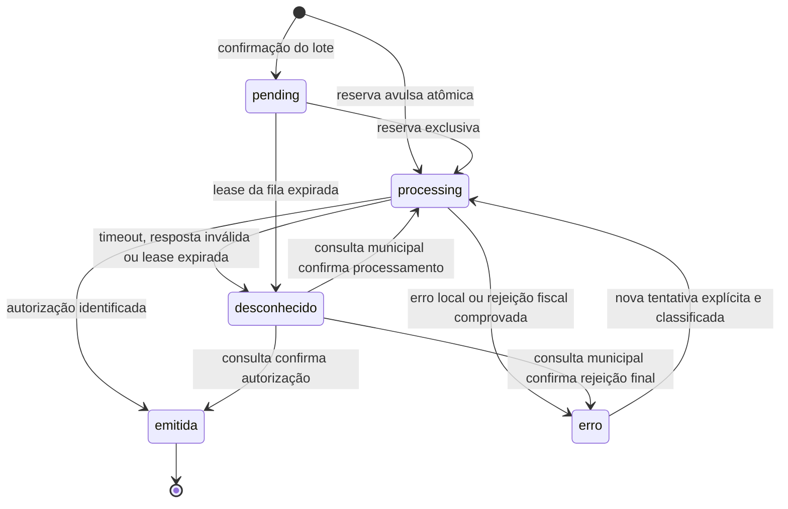

# NFS-e: estados, ambiguidade e renovação — Fase 05

Implementação sobre `79f1207`, dependente das migrations Fases 01–04,
terminando em `a4c7e2f9b1d6`. A Fase 05 acrescenta `f5a1c8e3d902`.
Não basta copiar os serviços para uma instalação sem essa cadeia de schema.

## Máquina de estados

`erro_tipo=local` significa que a preparação falhou antes de iniciar o
transporte. `erro_tipo=rejeicao` exige resposta fiscal estruturada; não é
sinônimo de qualquer HTTP 4xx. HTTP 409, indicação de duplicidade, 5xx,
timeout, corpo inválido e sucesso sem documento identificável ficam em
`desconhecido`. Erro legado sem classificação também não autoriza reenvio.

A reserva usa bloqueio de linha, UNIQUE para criação concorrente e releitura
após conflito. `tentativa_id` protege as escritas de resultado: a resposta
de uma tentativa substituída não altera a atual. `marcar_envio` só vence uma
vez por tentativa e confirma a intenção no banco antes do POST. Isso não é
uma transação distribuída com o fisco: se o processo cair entre o commit e
a resposta, a recuperação é por consulta, nunca por repetir o POST.

Há identidade persistida do worker, contador de tentativas, heartbeat e
lease. A tentativa usa o relógio do PostgreSQL e dura
`max(120, 3 × NFSE_TIMEOUT_SECONDS)` segundos (180 com o padrão de 60 s),
renovada a cada 20 s. A fila do lote usa 120 s, renovados a cada 30 s;
seus relógios de host devem estar sincronizados. O recuperador roda no boot
e a cada 60 s e somente expira leases vencidas. Não usa a ausência de uma
thread no processo atual como prova de abandono de outro worker.

Uma nota emitida não volta a pending/erro. A migration instala também uma
guarda PostgreSQL contra regressão e alteração de XML/identidade de nota
emitida, inclusive para escritores antigos. Cancelamento/substituição
fiscal futuros exigirão transições próprias; não devem contornar essa guarda.

`concluido` no lote exige exatamente todas as notas autorizadas.
`com_erro` exige todos os itens terminais (autorização ou erro classificado).
Pending, processing, desfecho desconhecido ou itens ausentes mantêm
`processando`, sem data fictícia de conclusão. O detalhamento recalcula os
contadores. A nota ainda é vinculada a um lote por vez; ao reprocessar erro
em outro lote, a tentativa anterior e seu lote ficam no histórico JSON.
O detalhamento de um lote antigo não reconstrói esse histórico como itens:
para auditoria completa do reprocessamento, consultar `tentativas_anteriores`.

## Quando a resposta da emissão se perde

1. Conferir a cobrança e o estado fiscal em **Notas Fiscais**. Não criar
   outra cobrança, trocar série/número ou emitir pelo portal para contornar
   a incerteza.
2. Usar **Consultar desfecho** (`POST /nfse/consultar/{billing_id}`). A rota
   usa o provedor e ambiente da tentativa, mesmo se a configuração atual mudou.
3. Nacional: consulta `GET /dps/{id}` e, obtendo chave, `GET /nfse/{chave}`.
   Municipal: consulta o protocolo original; sem protocolo, consulta o RPS
   original com série e identificação do prestador.
   O método SOAP é `ConsultarNfsePorRps`, com raiz XML
   `ConsultarNfseRpsEnvio`, conforme seção 4.9.3 do
   [manual Pública](https://publica-downloads.s3.sa-east-1.amazonaws.com/tmi/arquivos/manual-varios-itens.pdf).
   A aceitação do perfil de assinatura da consulta no ambiente municipal
   específico ainda exige homologação; falha mantém o estado bloqueado.
4. Consulta inconclusiva, 404 ou acesso não autorizado mantêm o bloqueio.
   Não há reenvio automático, nem botão de reemissão para esse estado.
5. Se a identidade legada estiver incompleta, encaminhar ao responsável
   fiscal: confrontar XML/RPS/DPS, protocolo, prestador e ambiente com o
   arquivo da empresa. Não deduzir ambiente a partir do `.env` atual.
   Esta fase não automatiza o preenchimento de identidade legada nem libera
   notas por uma declaração manual de ausência. Registrar a evidência e
   revisar o preenchimento da identidade em cópia antes de consultar.

Respostas de emissão desconhecidas podem produzir HTTP 502, como antes para
falhas de integração; o estado persistido pode ser lido com GET. Conflito de
lote sem itens elegíveis continua sendo erro de domínio HTTP 422. Os campos
e rotas anteriores permanecem; respostas acrescentam `erro_tipo`, competência
e discriminação e o estado `desconhecido`. Consumidores externos devem tratar
esse estado como bloqueado e consultar. Manter leitura de `erro` sem tipo
como incerta durante toda a janela de transição.

## Payload aprovado

Competência e discriminação do lote são propagadas explicitamente ao
provider. A DPS usa `dCompet` selecionado, inclusive histórico, e
`xDescServ` selecionado. A nota guarda os valores efetivamente serializados
e o código de serviço normalizado, além do XML exato transmitido.
O tomador continua sendo o pagador resolvido/interveniente; obrigações,
boletos consolidados e documentos SGR não são remodelados nesta fase.

O provider municipal preserva o leiaute existente `InfRps`. Ele não tem
um contrato homologado para uma competência diferente da emissão: rejeita
esse pedido localmente, antes de transmitir. Não escreve a competência
histórica no campo de data de emissão e não inventa uma tag no XSD.
O perfil municipal RSA-SHA1 também permanece recusado pela biblioteca;
não foi desativada a proteção nem trocada a canonicalização para fazê-lo passar.
Consultar notas municipais antigas continua disponível. Novas emissões
devem usar o Nacional conforme a configuração vigente da empresa.

## Renovação de certificado e recuperação de chaves

O upload administrativo continua cifrando PFX e senha com Fernet e mantendo
o cadastro anterior inativo. Não trocar/apagar `AILOS_TOKEN_ENCRYPTION_KEY`
como parte da renovação: isso perde acesso aos certificados e tokens antigos.
Guardar a chave de decifração e seus backups no mecanismo protegido da empresa.

Cada utilização lê novamente qual cadastro está ativo. O cache usa o id do
upload e os ciphertexts como versão; nenhum worker depende de um
`cache_clear` remoto. A validade do certificado é conferida a cada uso,
fora do cache. Arquivo PFX configurado via `.env` continua suportado e a
troca do conteúdo também invalida o cache. Falha de banco/decifração/validade
não permite retornar silenciosamente ao certificado antigo do `.env`.

Os PEM de mTLS são privados e temporários por requisição; o contexto só os
apaga quando a chamada termina, inclusive em timeout. Renovar não apaga o
PEM de outra chamada em andamento. Arquivos temporários da implementação
antiga podem sobreviver até retirar os containers antigos; não executar
limpeza global por prefixo enquanto houver processos antigos em voo.

Antes de liberar emissão após renovar, conferir titular/CNPJ/validade e
executar o roteiro de homologação restrita aprovado. A PKI sintética dos
testes comprova rotação e handshake local, não aceitação ICP-Brasil no fisco.

## Preflight, migração e rollback

Em cópia autorizada, executar `python scripts/nfse_preflight.py` antes e
depois de `python -m alembic upgrade head`. O inventário só lê contagens e
ids; não imprime XML, senha ou chave. A migration adiciona campos e move
pending/processing/erro legados sem classificação para `desconhecido`.
Nenhum XML, número, chave, série, protocolo ou mensagem existente é apagado.
Não foram medidos/alterados dados de produção ou do banco local ativo.

Para rollback: bloquear emissão (`NFSE_ENABLED=false`), retirar emissores
da versão nova e aguardar/conciliar tentativas em voo. Não misturar versões
emitindo. Com a imagem nova ainda disponível, executar
`alembic downgrade a4c7e2f9b1d6`: apenas o carimbo recua; colunas, estados e
guardas permanecem. Só então iniciar a imagem anterior, que desconhece o
revision id novo, mantendo emissão desabilitada. Para avançar novamente,
`alembic upgrade head` é idempotente e conserva as evidências.

O ensaio registrou o mesmo SHA-256 dos documentos antes, após downgrade e
após reupgrade; código anterior leu as notas e os dois UPDATEs de regressão
foram recusados. Ver [evidência](../validacao/fase-05/rollback.json).
Não usar downgrade para desfazer uma autorização, apagar dados ou mudar numeração.

## Decisões operacionais propostas

| Decisão | Proposta implementada | Efeito e validação necessária |
|---|---|---|
| D5.1 — lease | 180 s por tentativa com timeout padrão, heartbeat 20 s; fila 120/30 s | Sem heartbeat, bloqueia para consulta; medir latência/pausas dos workers antes do corte |
| D5.2 — ausência em consulta | 404 nunca libera reenvio | Evita duplicata em consistência eventual; empresa deve definir procedimento fiscal para casos que não se resolvem |
| D5.3 — legado sem identidade | Reconciliação assistida, sem inferência do ambiente atual | Responsável fiscal deve conferir e completar a identidade documentada; não há backfill inventado |
| D5.4 — homologação | Nacional com mesmas referências, namespaces, SHA256 e C14N exclusiva | Registrar autorização da empresa, ambiente restrito, XML/checksum, resposta e versões; nunca produção por padrão |
| D5.5 — certificados antigos | Retenção cifrada durante a janela de transição | Empresa define prazo de retenção e responsáveis pela custódia da chave; nenhum certificado é apagado nesta fase |
